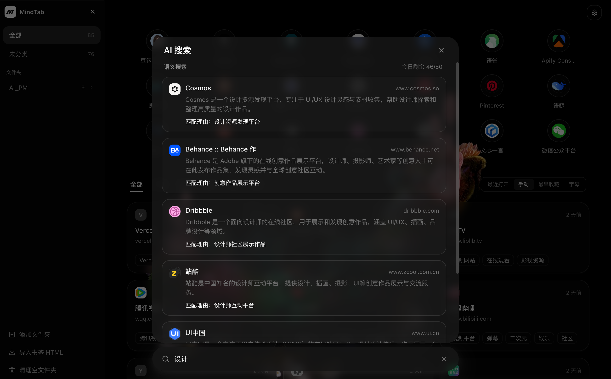
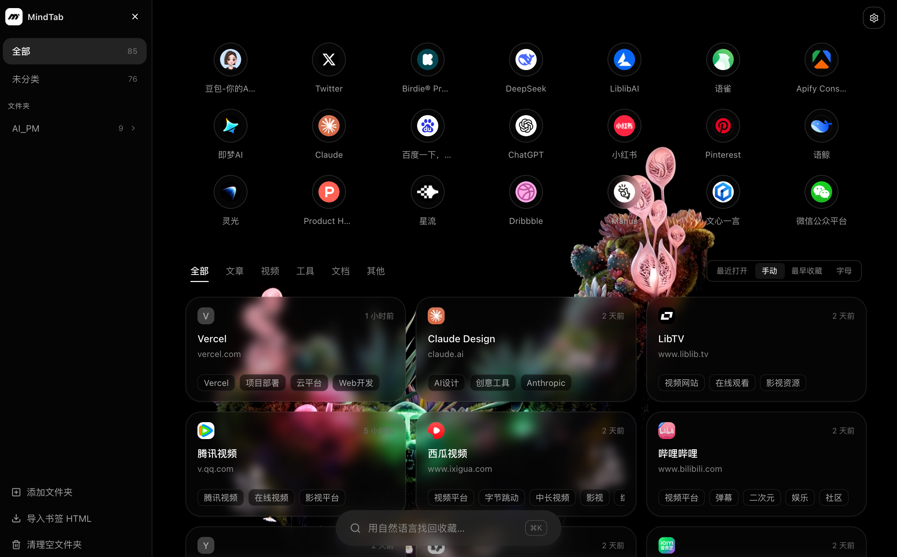
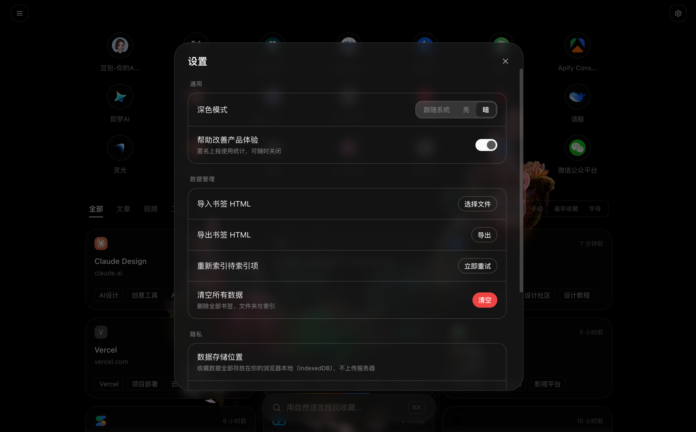

# MindTab

> 不用整理，随时找得到 — smart search, auto-organize, zero effort

MindTab 是一个 Chrome 浏览器扩展，替代你的新标签页。一键收藏当前网页，AI 自动生成中文摘要、智能标签与内容分类；之后用日常语言描述你想找的东西，一搜即达。

- 官网：https://mindtab.cn
- Chrome Web Store：https://chromewebstore.google.com/detail/mindtab/ildffcgdmbcaenjkbapfcgaklaejohme


| AI 搜索 | 侧边栏文件夹 | 设置 |
|---|---|---|
|  |  |  |

---

## 功能亮点

- **一键收藏**：点扩展图标或右键菜单收藏当前页面，AI 自动生成摘要 / 标签 / 分类
- **自然语言搜索（两阶段）**：输入即出本地结果（中文分词检索，防抖 250ms），回车触发 AI 语义精排——「上周看的那篇 React 性能优化文章」这样的描述也能搜到；支持 ↑↓ 方向键选择，常用书签自动靠前；AI 不可用时保持关键词搜索
- **智能分类**：书签自动归类（文章 / 视频 / 工具 / 文档等），支持自定义文件夹、拖拽排序、置顶
- **导入 / 导出**：标准 HTML 书签文件；待确认面板批量管理新收藏
- **Glass Dashboard 视觉**：毛玻璃界面，亮色 / 暗色 / 跟随系统，视频壁纸背景
- **隐私优先**：所有数据存储在本机（IndexedDB），不上传任何服务器；AI 走的也是你自己的 API Key

---

## 安装

> **版本说明**：商店版内置 AI 服务（免配置，开箱即用）；本仓库为 BYOK 版，需自带 API Key。书签数据格式完全兼容。

### 方式一：Chrome Web Store（推荐）

直接安装线上版本：https://chromewebstore.google.com/detail/mindtab/ildffcgdmbcaenjkbapfcgaklaejohme

### 方式二：下载 Release 加载

1. 从本仓库 [Releases](../../releases) 页面下载最新的构建包并解压
2. 打开 `chrome://extensions/`，右上角开启「开发者模式」
3. 点「加载已解压的扩展程序」，选择解压出的 `dist/` 文件夹

### 方式三：源码构建

```bash
npm install
npm run build     # 产物在 dist/
```

然后同上，在 `chrome://extensions/` 加载 `dist/` 文件夹。

---

## 配置 AI 服务（首次使用请看这里）

MindTab 采用 **BYOK（Bring Your Own Key）** 模式：在设置页面填入自己的 API Key，扩展直连你配置的大模型服务商，不经任何中转服务器。首次保存时 Chrome 会弹出对应服务商的访问授权，点「允许」即可。

配置入口：**设置 → AI 服务**

### 支持的服务商（12 家预设 + 自定义）

| 服务商 | Key 申请入口 | 说明 |
|---|---|---|
| DeepSeek | https://platform.deepseek.com | 默认推荐，中文摘要效果好、价格低 |
| OpenAI | https://platform.openai.com | |
| Kimi（月之暗面） | https://platform.moonshot.cn | |
| 通义千问 | https://bailian.console.aliyun.com | |
| 智谱 GLM | https://open.bigmodel.cn | |
| 豆包（火山引擎） | https://console.volcengine.com/ark | |
| 硅基流动 | https://cloud.siliconflow.cn | |
| MiniMax | https://platform.minimaxi.com | |
| 阶跃星辰 | https://platform.stepfun.com | |
| 小米 MiMo | https://platform.xiaomimimo.com | |
| Claude (Anthropic) | https://console.anthropic.com | |
| OpenRouter | https://openrouter.ai | 一个 Key 转接多家模型 |
| 自定义 | — | 任何 OpenAI 兼容端点，见下 |

填好 Key 后可一键**获取模型列表**（拉取该账号真实可用的模型下拉选择），并**测试连接**验证配置；不支持模型列表接口的厂商自动回退手动输入。

### 自定义服务商

任何提供 OpenAI 兼容 `/chat/completions` 接口的服务（如各类聚合网关、本地推理服务）都可以用「自定义」接入：

- **Base URL**：填到 `/v1` 为止（例如 `https://api.example.com/v1`），不要带 `/chat/completions` 后缀
- **API Key** 与 **模型名**：按你的服务商要求填写

### 没配置 Key 会怎样？

收藏、文件夹管理、导入导出等功能完全正常；AI 索引会挂起等待（配置 Key 后自动补齐），搜索自动降级为关键词匹配。

---

## 隐私

- **书签数据**（标题、URL、摘要、标签、文件夹）全部存储在本地浏览器 IndexedDB，不上传任何服务器
- **API Key** 仅保存在本地 `chrome.storage.local`，不会发送到除你所配置的 AI 服务商之外的任何地方
- 网站图标（favicon）通过公共 favicon 服务按域名获取

---

## 已知限制

- AI 搜索先在本地粗筛出最相关的 50 条候选，仅把候选的标题 / 摘要压缩后送入 prompt 精排（单次约几千 token），费用可控但仍会产生消耗
- AI 调用费用由你自己的 API Key 承担，请留意所选服务商的计费
- 仅支持 Chrome（Manifest V3）

---

## 参与开发

架构说明见 [docs/ARCHITECTURE.md](docs/ARCHITECTURE.md)，贡献流程见 [CONTRIBUTING.md](CONTRIBUTING.md)。

```
src/
├── shared/        公共层 —— UI 组件、数据库、工具函数（不含业务逻辑）
├── features/      业务模块 —— 每个功能自成一体（书签、搜索、设置…）
├── newtab/        新标签页入口 —— 唯一的 HTML 入口，组装所有 feature
├── background/    Chrome MV3 后台服务（Service Worker）
├── content/       Content Script（页面注入脚本）
├── popup/         扩展图标 popup
├── styles/        全局样式
├── assets/        构建期静态资源
└── global.d.ts    全局类型声明
```

### 技术栈

| 层 | 用的什么 |
|---|---|
| 语言 | TypeScript |
| 框架 | React 19 |
| 构建 | Vite + @crxjs/vite-plugin |
| 样式 | Tailwind CSS v4 |
| 状态 | Zustand |
| UI | shadcn/ui + Radix UI |
| 动效 | Motion |
| 拖拽 | @dnd-kit |
| 本地搜索 | MiniSearch + `Intl.Segmenter` 中文分词 |
| 测试 | Vitest（单元）+ Puppeteer（UI 冒烟） |
| 存储 | IndexedDB（书签）+ chrome.storage（设置） |
| AI | 用户自配置的 OpenAI 兼容服务（12 家预设 / 自定义） |

### 测试与 CI

```bash
npm run lint      # ESLint，仓库保持 0 问题
npm test          # Vitest 单元测试（搜索分词/粗筛/prompt/frecency）
npm run smoke     # Puppeteer 真实加载扩展的 UI 冒烟（需本地显示环境）
```

GitHub Actions 在 push main / PR 时自动跑 **build + lint + test** 三关；smoke 需真实显示环境，保留为本地发版前手动步骤。

---

## License

[MIT](LICENSE)
